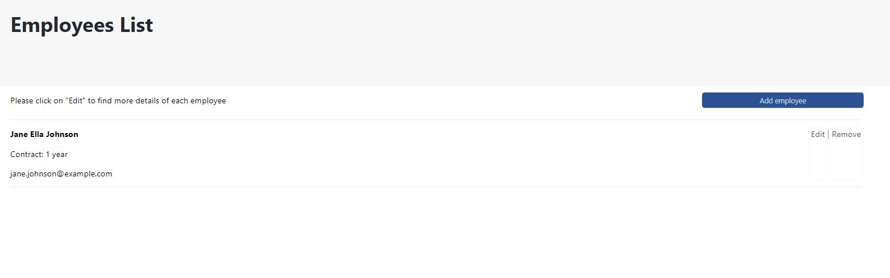
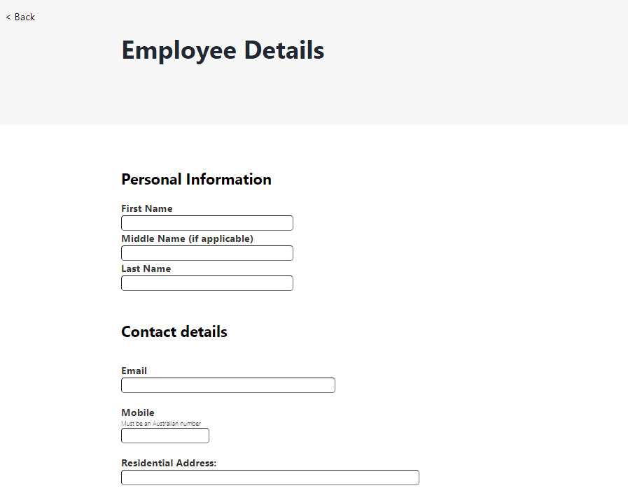
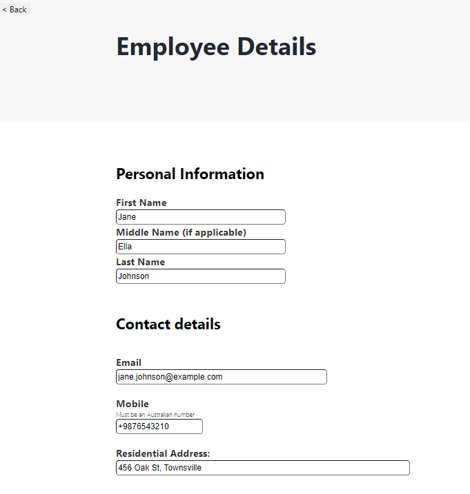
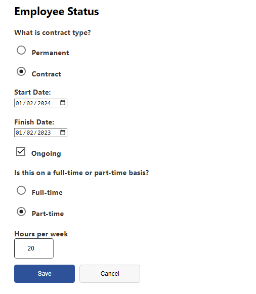

# Employee Creator

## Demo & Snippets

### Home page:



### Create page:



### Edit page:




## Requirements / Purpose

### Prompt:

We need a web application to create, list, modify and delete employees. The application should consist of a spring RESTful API and a React Typescript frontend. The schema for the employee is left to the criteria of the candidate.

---

## Build Steps

1. Clone project first:

```bash
git clone git@github.com:AnthonySchramko/EmployeeCreator.git
```

### Backend

Import backend into a Java IDE, such as Eclipse, and run the App.Java

### Frontend:

Path to directory

```bash
cd EmployeeCreator/Frontend
```

Install dependencies

```bash
npm install
```

Start the server

```bash
npm run dev
```

### Database:

Create a database in MySQL and call it 'employees'

## Design Goals / Approach

- This website was made with a simplistic aesthetic, similar to a NSW Government form without the extra assets. The focal point being the form and the list of employee's.
- The home page has a lot of white space to not overwhelm the user, and having a salience of the employee's.
  The create/edit page is solely the form in an aesthetic structure, allowing for the user to easily follow the inputs.

---

## Features

- Home page with a list of employee's
  - This shows employee name (first, middle and lastnames)
  - Contract type and length is also displayed with their email address
- Home page also has the ability to path to either a specific employee, allowing for them to edit or remove the employee from the list.
- The user can also create employee's by clicking the "Add employee" button.
- The form page has the ability to create or edit users depending on chosen functionality, is linked to a database which is updated after each successful form submission.

---

## Known issues

- Currently no minimum contract length, which means that the home page's displayed length can sometimes not make logical sense (0 months).

---

## Future Goals

- Add more tests
- Add more data validation for phone number to force it as Australian
- Fix contract length displayed on homepage

---

## What did you struggle with?

- Working with the backend and a relationship between contract and employee was a struggle at first. This took a bit longer than wanted, and a lot of research to figure out what the errors were saying. In most cases, it would have a never-ending loop when creating or updating data.
- The data returned from the form was not in the format I wanted, so data types had to be changed for easier manipulation. An example is the radio/check buttons weren't returning correct data type so had to convert value and database to be a string.

---
